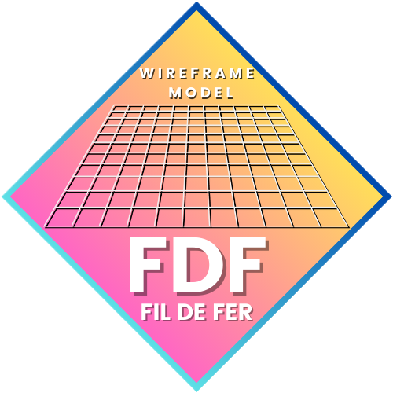
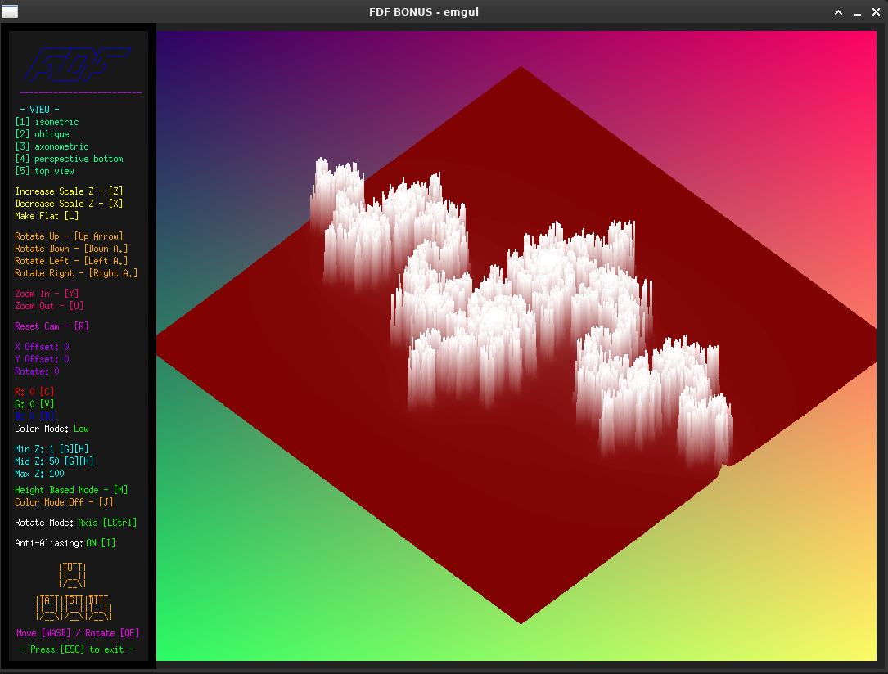

  
  <h2>42 FDF PROJECT</h2>
    
    
    
    
    
   
<h4>
    <a href="https://github.com/emre-mr246/42_ring2_fdf/issues">❔ Ask A Question</a>
   · 
    <a href="https://github.com/emre-mr246/42_ring2_fdf/issues">🪲 Report Bug</a>
   · 
    <a href="https://github.com/emre-mr246/42_ring2_fdf/issues">💬 Request Feature</a>
</h4>

## Introduction 🚀

The "fdf" project challenges students to create a graphical representation of a landscape using a provided dataset of coordinates. This project is a fundamental part of the 42 school curriculum, aiming to develop skills in parsing files, working with graphics libraries, and understanding 3D representations.

Note: This project is intended for Linux systems. For running on macOS, modifications to the Makefile and adjustments in the MinilibX library are required.

## Objective 🎯

The objective of the "fdf" project is to generate a wireframe representation of a terrain based on coordinates provided in a file. This involves parsing the file to extract coordinate data, transforming these coordinates into a 3D space, and using a graphics library to draw lines between points to visualize the terrain.

## Image 📸

## Usage 🔍

1. In the project's main directory, compile the library using the `make` command.
   `$ make bonus` 

2. You can run the program with the following command:
   `$ ./fdf maps/pyramide.fdf` 
    
## Score 🥇

